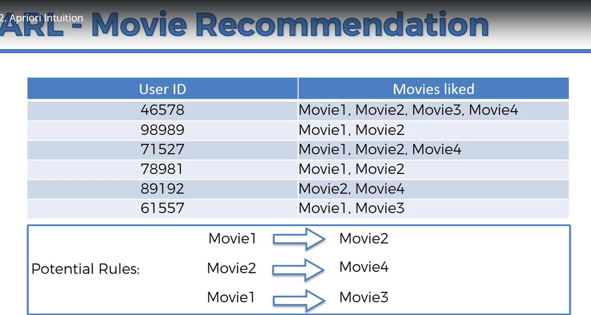
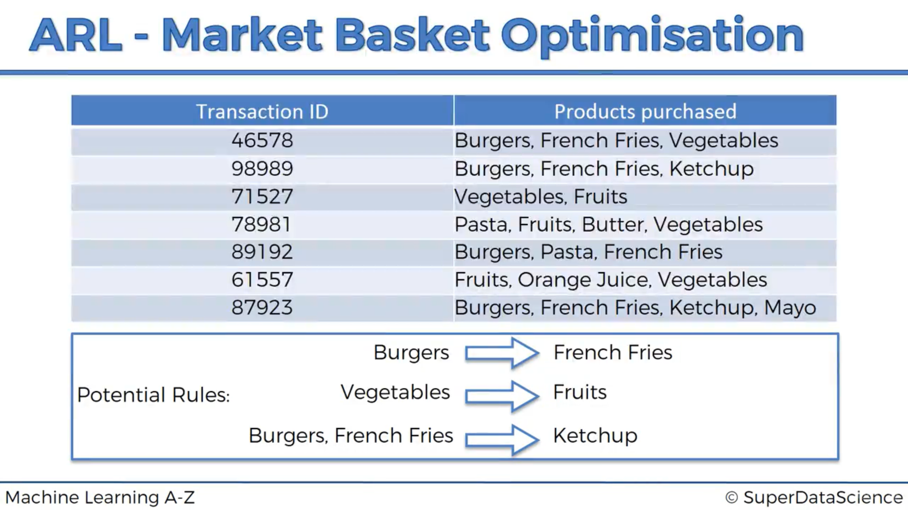
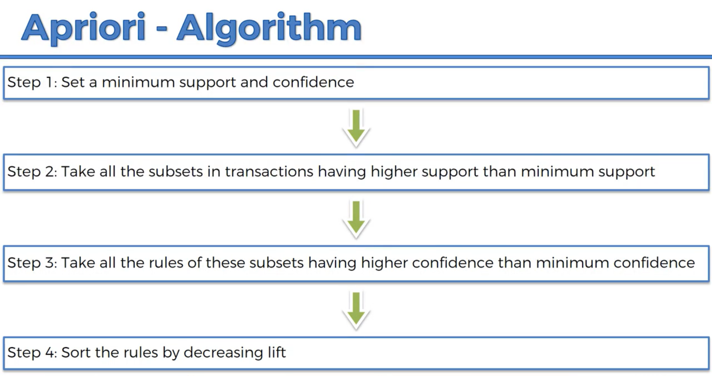
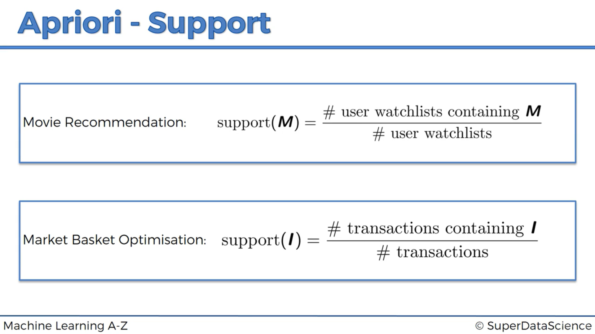
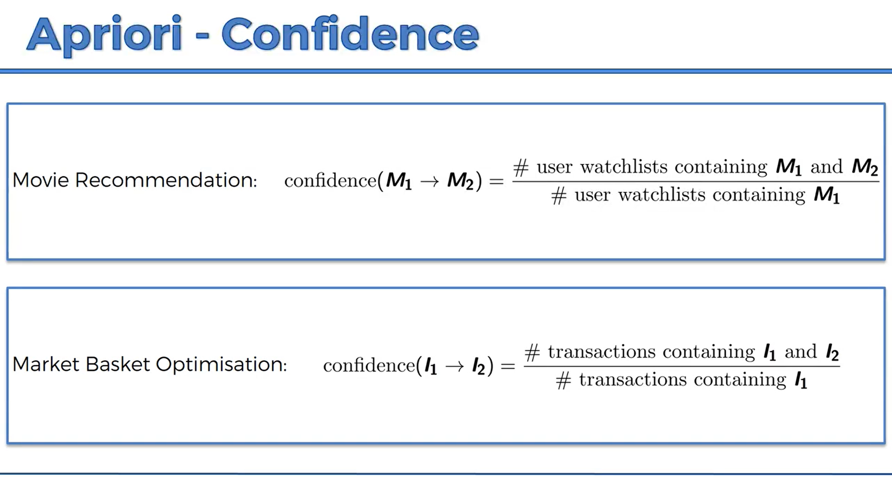
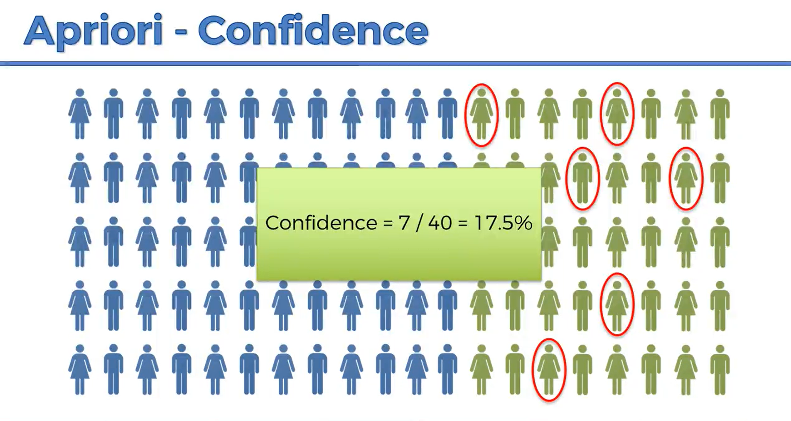
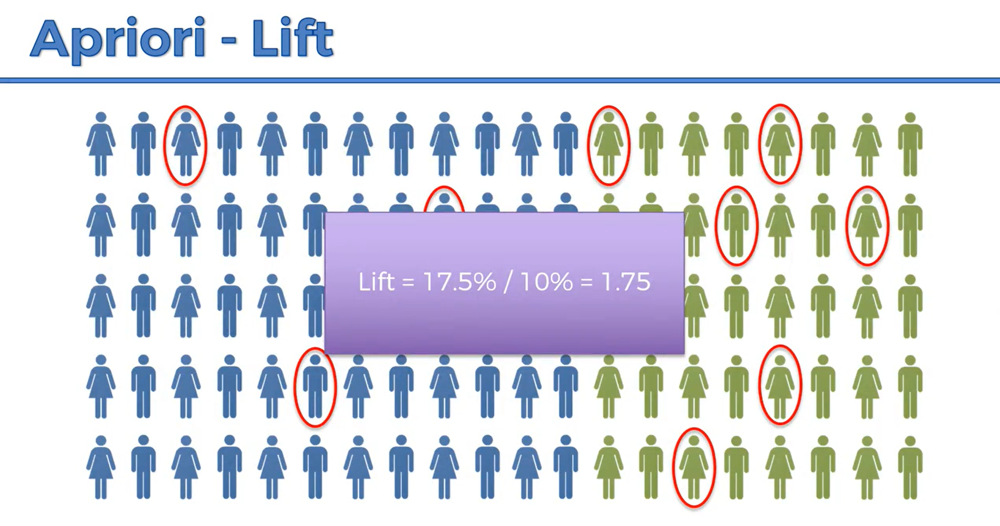

# Apriori-Recommendation-Algortihm-for-Supermarket-transactions-
This project uses an apriori algorithm from supermarket transaction data from a store in France to recommend product placement for higher sales revenue

ASSOCIATION RULE LEARNING APRIORI ALGORITHM

People who bought also bought, people who liked also liked...

Apriori is designed to operate on a database containing transactions.  For exaplem, collections of items purchased by by customers per transaction, or details of website visits frequency.

Apriori uses a bottom up approach, where frequent subsets are extended one item at a time, a step known as **candidate generation** and groups of candidates are tested against the data.

 

The Apriori algorithm has 3 parts to it: The **Support**, **Confidence**, and **Lift**

 

The Support is similar to the intuition for Naive Bayesian Classification.  So we have number of users who watched **Movie M** divided by the total number of users in a dataset, or the number of customers who bought **Product I** divided by total number of transactions.

In step two we find the Confidence. The confidence is the number of occurences (tranactions) with transactions containing #Item1 **and** Item2 divided by transactions containing just Item1.  We are testing a **rule**.  Here we have a **hypothesis** that people who bought Item1 also are likely to like Item2.  Or people who saw (we assume, liked) Movie1 also liked Movie2.  

 

In the last step we calculate the lift for each "Rule" or hypothesized association.  The lift is basically the confidence divded by the support.  So in the illustration below using our case of transactions, out of a population of 100, those in green are people who purchased mayonaise, and people circled in red are those that purchased scallops.  If we take another random population, what is the likely hood if we recommend scallops, what is the likelyhood that they will like it, but now using **prior** knowledge that they like Mayonaise, hence *Apriori*.  In this new population let's only recommend scallops to those that hay also purchased mayonaise and lemons.  Or using a movie recommendation example, lets only recommend *Ex Machina* (not a particularly popular movie) to those who have seen *Interstellar* becuase we beleive they will have a greater chance of liking it or at least being curious and click that play button.

 

So we have a greater chance of that random person liking scallops if they are also purchasing mayonaise and lemons (or vice e versa) or likeing *Ex Machina* if they have seen *Interstellar*

