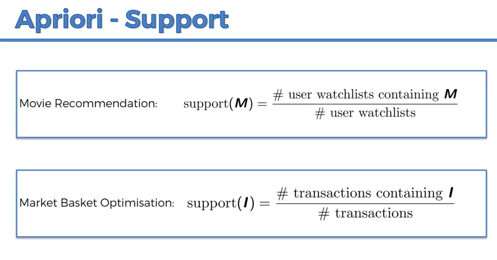

# Apriori-Recommendation-Algortihm-for-Supermarket-transactions-
This project uses an apriori algorithm from supermarket transaction data from a store in France to recommend product placement for higher sales revenue

ASSOCIATION RULE LEARNING APRIORI ALGORITHM

People who bought also bought, people who liked also liked...

Apriori is designed to operate on a database containing transactions.  For exaplem, collections of items purchased by by customers per transaction, or details of website visits frequency.

Apriori uses a bottom up approach, where frequent subsets are extended one item at a time, a step known as **candidate generation** and groups of candidates are tested against the data.

 

The Apriori algorithm has 3 parts to it: The **Support**, **Confidence**, and **Lift**

 

The Support is similar to the intuition for Naive Bayesian Classification.  So we have number of users who watched **Movie M** divided by the total number of users in a dataset, or the number of customers who bought **Product I** divided by total number of transactions.

In step two we find the Confidence. The confidence is the number of occurences (tranactions) with transactions containing #Item1 **and** #Item2 divided by transactions containing just #Item1.  We are testing a **rule**.  Here we have a **hypothesis** that people who bought #Item1 also are likely to like #Item2.  Or people who saw (we assume, liked) Movie1 also liked Movie2.  

 

